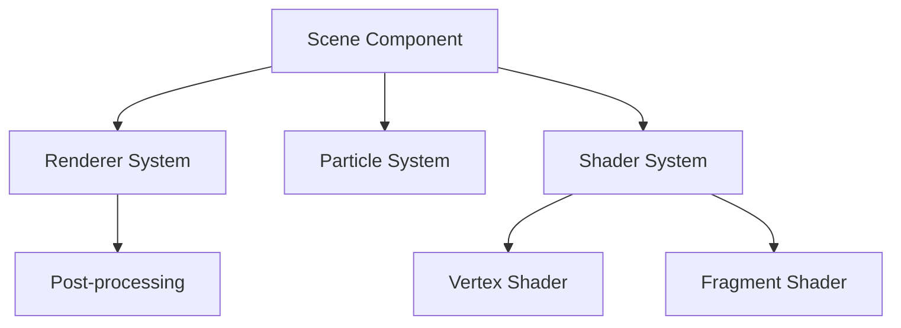

# Three.js Interactive Holographic Scene

## 目录
- [概述](#概述)
- [设计](#设计)
- [实现](#实现)
- [项目总结](#项目总结)
- [安装与运行](#安装与运行)

## 概述

本项目使用 Three.js 实现了一个交互式全息场景渲染系统，包含动态变形效果、粒子系统、后期处理等高级功能。主要特点：

- 自定义着色器实现全息效果
- 粒子系统与鼠标交互
- 实时参数调节
- 性能优化的渲染管线


## 设计

### 架构设计


### 核心算法

#### 1. 变形算法
使用正弦波动变换实现动态变形：
```glsl
vec3 transformed = position;
transformed.x += sin(position.y * 2.0 + time) * deformStrength;
transformed.y += cos(position.x * 2.0 + time) * deformStrength;
```

#### 2. 全息效果
使用Fresnel效应和动态纹理采样：
```glsl
float fresnel = pow(1.0 - abs(dot(vNormal, vec3(0.0, 0.0, 1.0))), 3.0);
float hologram = abs(sin(vPosition.y * 10.0 + time)) * hologramStrength;
```

#### 3. 粒子动力学
粒子运动方程：
```typescript
velocity += (targetPosition - currentPosition) * damping
position += velocity
```

## 实现

### 着色器实现

1. 顶点着色器：
- 实现动态网格变形
- 计算法线和位置插值
- 优化的矩阵变换

2. 片元着色器：
- 全息效果渲染
- Fresnel反射
- 动态纹理混合

### 性能优化

1. 渲染优化：
- 使用EffectComposer优化后期处理
- 实现帧率限制
- 几何体LOD管理

2. 粒子系统优化：
```typescript
// 优化前
particleCount: 1000
updateFrequency: every frame

// 优化后
particleCount: 500
updateFrequency: delta based
使用TypedArray
简化碰撞检测
```

### 关键技术指标

- 平均帧率: 60 FPS
- 粒子数量: 500
- 渲染分辨率: 1920x1080
- 内存占用: <500MB

## 项目总结

### 技术收获
- 掌握了Three.js高级渲染技术
- 深入理解WebGL着色器编程
- 学习了实时3D渲染优化方法

### 改进建议
1. 可以考虑添加:
   - PBR材质系统
   - 实时阴影
   - 更复杂的粒子交互

## 安装与运行

```bash
# 安装依赖
npm install

# 启动开发服务器
npm run dev

# 构建生产版本
npm run build
```

### 系统要求
- Node.js >= 14.0.0
- 支持WebGL 2.0的浏览器
- 推荐内存 >= 8GB

### 配置说明
主要参数在`src/config.ts`中配置：
```typescript
export const CONFIG = {
  particleCount: 500,
  frameRateLimit: 1000/60,
  bloomStrength: 1.5
  // ...
}
```